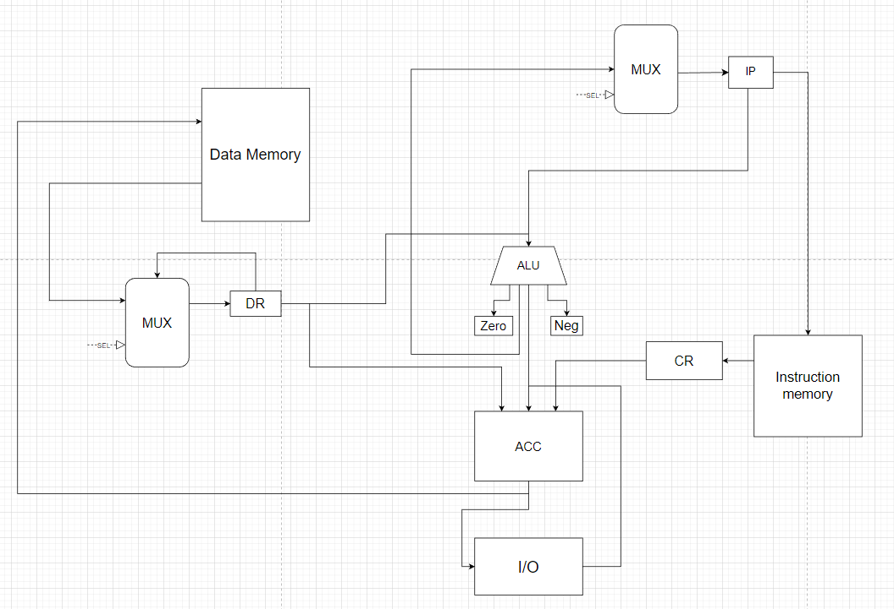

# Архитектура Компьютера. Лабораторная работа №3.

## Вариант
`alg | acc | harv | hw | instr | struct | stream | mem | prob5`

* `alg`: java-подобный язык.
* `acc`: все вычисления построены вокруг регистра **AC**, выполняющего роль аккумулятора.
* `harv`: Гарвардская архитектура.
* `hw`: Control Unit реализован как часть модели, микрокода нет.
* `instr`: каждая инструкция расписана по-тактово, но в журнале фиксируется только результат выполнения
* `struct` каждая инструкция представляет собой 16-и битное число
* `stream`: ввод-вывод реализован как поток данных
* `mem`: mem-mapped isa
* `prob5`:  Project Euler. Problem 5

## Язык

* Обьявление через ключевое слово `let`.
* Доступны переменный типа `string` и `number`.
* Доступен цикл `while(number)`.
* Доступено условие `if(condition, extra_condition)`.
* Функция `print(number|string)`.
* Функция `input()` считывает значение.
* Разрешенные математические операции: `+`(бинарный плюс), `-`(бинарный минус),`=`(присваивание), `%`(остаток от деления), `*`(умножение).

### BNF

#### `<program> ::= (<source element>)+`
#### `<source element> ::= <statement>`
#### `<statement> ::= <allocation statement> | <assignment statement> | <if statement> | <iteration statement> | <read statement> | <print statement>`
#### `<allocation statement> ::= "let" <name> "=" <number> | <row> ";"`
#### `<assignment statement> ::= <name> "=" <number> | <name> | <expression> ";"`
#### `<if statement> ::= "if" (<name> | <expression> | <number>) <comparison sign> (<name> | <expression> | <number>) "{" (<statement>)+ "}"`
#### `<iteration statement> ::= "while" (<name> | <expression> | <number>) <comparison sign> (<name> | <expression> | <number>) "{" (<statement>)+ "}"`
#### `<read statement> ::= "input(" <name> ");"`
#### `<print statement> ::= "print( <name> ");"`
#### `<expression> ::= (<name> | <number>) <operation sign> (<name> | <number>)`
#### `<comparison sign> ::= "!=" | "==" | ">" | "<" | "<=" | ">="`
#### `<name> ::= [a-zA-Z]+`
#### `<number> ::= [0-9]+`
#### `<row> ::= "[a-zA-Z]*"`
#### `<operation sign> ::= "+" | "-" | "/" | "%" | "*"`

### Пример
```javascript
let n = 2520;
let i = 20;
while (i > 0)
{
    if (n % i == 0)
    {
        i = i - 1;
    }
    else
    {
        n = n + 2520;
        i = 20;
    }
    if (i == 1)
    {
        print(n);
    }
}
```

```javascript
let temp = "hello, world";
print(temp);
```

## Процессор

Реализован в модуле [machine.py](./machine.py)

Интерфейс командной строки с запуском модуля: `python machine.py <target_file> <input_file>`

### Модель процессора


Управляющие сигналы:
* Sel(IP)  - выставить значение регистра IP
  * 1 - увеличить на 1
  * 0 - загрузить значение из вне
* Sel(DR) - передать значение DR

### Организация памяти

Память инструкций и данных раделены на два модуля.
Доступ к памяти может осуществляться только через store/load инструкции

Модель памяти процессора:
* Память команд - Машинное слово не определено, реализация при помощи массива словарей
* Память данных - 32 бита, знаковое

Размер памяти данных - 2048
Размер памяти инструкций - 2048

В процессоре всего расположено 5 регистров.
Размер регистра - 32 бита.
* `ir` - регистр ввода данных
* `or` - регистр вывода данных
* `ip` - регистр адресации в памяти инструкций
* `dr` - регистр данных
* `cr` - регистр текущей инструкции

Присутствует два флага состояния на выходах АЛУ - Zero Flag и Negative Flag

### Набор инструкций
| Синтаксис        | Кол-во тактов | Комментарий                                     |
|:-----------------|:--------------|:------------------------------------------------|
| `ld` (int)       | 4             | int ->acc                                       |
| `ld` (0xaddr)    | 4             | data_mem[addr] -> acc                           |
| `ST` (reg)       | 4             | acc -> data_mem                                 |
| `add` (num)      | 4             | acc + num -> acc                                |
| `add` (addr)     | 4             | acc + data_mem[addr] -> acc                     |
| `sub` (num)      | 4             | acc - num -> acc                                |
| `sub` (addr)     | 4             | acc -data_mem[addr] -> acc                      |
| `mul` (reg1)     | 4             | acc * num -> acc                                |
| `mul` (addr)     | 4             | acc * data_mem[addr] -> acc                     |
| `div` (num)      | 4             | acc / num -> acc                                |
| `div` (addr)     | 4             | acc / data_mem[addr] -> acc                     |
| `mod` (num)      | 4             | acc % num -> acc                                |
| `mod` (addr)     | 4             | acc % data_mem[addr] -> acc                     |
| `input`          | 4             | ir -> acc                                       |
| `print` (1/0)    | 3             | acc -> or<br/>ch(reg) -> or                     |
| `jmp` (num)      | 2             | num -> ip                                       |
| `inc`            | 4             | acc + 1 -> acc                                  |
| `dec`            | 4             | acc - 1 -> acc                                  |
| `jle` (addr,num) | 4             | zero_flag OR neg_flag => num -> acc             |
| `jl` (addr,num)  | 4             | NOT zero_flag AND neg_flag => num -> acc        |
| `jne` (addr,num) | 4             | NOT zero_flag  => num -> acc                    |
| `je` (addr,num)  | 4             | zero_flag  => num -> acc                        |
| `jge` (addr,num) | 4             | zero_flag OR NOT neg_flag => num -> acc         |
| `jg` (addr,num)  | 4             | NOT zero_flag AND NOT neg_flag => num -> acc 1  |
| `hlt`            | 1             |                                                 |

Устройства ввода/вывода определены как два буфера данных

## Кодирование 

### Структура команды

* Машинный код представлен в формате JSON списка операционных команд
* Одна инструкция - словарь, содаержащий операционный код и аргументы

```json
{
    "opcode": "ld",
    "arg1": "0x1"
}
```

* `opcode` - код операции
* `arg1` - первый аргумент (может отсутствовать) 
* `arg2` - второй аргумент аргумент (может отсутствовать)

### Транслятор

Реализован в модуле [translator.py](./translator.py)

Интерфейс командной строки с запуском модуля: `python translator.py <source_file> <target_file>`

Этапы трансляции:
* Загрузка исходного кода
* Рекурсивный проход по строкам в файле и обработка их в соответствии с регулярными выражениями
* Построение алгоритма работы программы
* Выгрузка алгоритма в конечный файл

Пример:

```javascript
let temp = "";
input(temp);
while (temp != EOF)
{
    print(temp);
    input(temp);
}
```

```json
[
    {
        "opcode": "ld",
        "arg1": 0
    },
    {
        "opcode": "st",
        "arg1": "0x0"
    },
    {
        "opcode": "input"
    },
    {
        "opcode": "st",
        "arg1": "0x0"
    },
    {
        "opcode": "ld",
        "arg1": "0x0"
    },
    {
        "opcode": "je",
        "arg1": "0",
        "arg2": 12
    },
    {
        "opcode": "ld",
        "arg1": "0x0"
    },
    {
        "opcode": "print",
        "arg1": 1
    },
    {
        "opcode": "input"
    },
    {
        "opcode": "st",
        "arg1": "0x0"
    },
    {
        "opcode": "jmp",
        "arg2": 5
    },
    {
        "opcode": "halt"
    }
]
```

## Аппробация

* Исходные коды готовых программ
  * [hello](./tests/hello)
  * [cat](./tests/cat)
  * [prob5](./tests/prob5)
* Результаты работы транслятора
  * [hello.out](./tests/hello.out) 
  * [cat.out](./tests/cat.out) 
  * [prob5.out](./tests/prob5.out) 
* Входные данные для программ
  * [token.out](./tests/token.out)

Описание тестов - [tests.py](./tests.py)

Пример запуска теста:
```shell
> ./translator.py ./tests/hello ./tests/hello.out
> ./machine.py ./tests/hello.out ./token.out

  DEBUG:root:{TICK: 1, ACC: 72, IR: 0, OR: 0, IP: 1, CR: {'opcode': <Opcode.LD: 'ld'>, 'arg1': 72}, DR: 72}
  DEBUG:root:{TICK: 2, ACC: 72, IR: 0, OR: 0, IP: 2, CR: {'opcode': <Opcode.ST: 'st'>, 'arg1': '0x0'}, DR: 72}
  DEBUG:root:{TICK: 3, ACC: 101, IR: 0, OR: 0, IP: 3, CR: {'opcode': <Opcode.LD: 'ld'>, 'arg1': 101}, DR: 101}
  DEBUG:root:{TICK: 4, ACC: 101, IR: 0, OR: 0, IP: 4, CR: {'opcode': <Opcode.ST: 'st'>, 'arg1': '0x1'}, DR: 101}
  DEBUG:root:{TICK: 5, ACC: 108, IR: 0, OR: 0, IP: 5, CR: {'opcode': <Opcode.LD: 'ld'>, 'arg1': 108}, DR: 108}
  DEBUG:root:{TICK: 6, ACC: 108, IR: 0, OR: 0, IP: 6, CR: {'opcode': <Opcode.ST: 'st'>, 'arg1': '0x2'}, DR: 108}
  DEBUG:root:{TICK: 7, ACC: 108, IR: 0, OR: 0, IP: 7, CR: {'opcode': <Opcode.LD: 'ld'>, 'arg1': 108}, DR: 108}
  DEBUG:root:{TICK: 8, ACC: 108, IR: 0, OR: 0, IP: 8, CR: {'opcode': <Opcode.ST: 'st'>, 'arg1': '0x3'}, DR: 108}
  DEBUG:root:{TICK: 9, ACC: 111, IR: 0, OR: 0, IP: 9, CR: {'opcode': <Opcode.LD: 'ld'>, 'arg1': 111}, DR: 111}
  DEBUG:root:{TICK: 10, ACC: 111, IR: 0, OR: 0, IP: 10, CR: {'opcode': <Opcode.ST: 'st'>, 'arg1': '0x4'}, DR: 111}
  DEBUG:root:{TICK: 11, ACC: 32, IR: 0, OR: 0, IP: 11, CR: {'opcode': <Opcode.LD: 'ld'>, 'arg1': 32}, DR: 32}
  DEBUG:root:{TICK: 12, ACC: 32, IR: 0, OR: 0, IP: 12, CR: {'opcode': <Opcode.ST: 'st'>, 'arg1': '0x5'}, DR: 32}
  DEBUG:root:{TICK: 13, ACC: 119, IR: 0, OR: 0, IP: 13, CR: {'opcode': <Opcode.LD: 'ld'>, 'arg1': 119}, DR: 119}
  DEBUG:root:{TICK: 14, ACC: 119, IR: 0, OR: 0, IP: 14, CR: {'opcode': <Opcode.ST: 'st'>, 'arg1': '0x6'}, DR: 119}
  DEBUG:root:{TICK: 15, ACC: 111, IR: 0, OR: 0, IP: 15, CR: {'opcode': <Opcode.LD: 'ld'>, 'arg1': 111}, DR: 111}
  DEBUG:root:{TICK: 16, ACC: 111, IR: 0, OR: 0, IP: 16, CR: {'opcode': <Opcode.ST: 'st'>, 'arg1': '0x7'}, DR: 111}
  DEBUG:root:{TICK: 17, ACC: 114, IR: 0, OR: 0, IP: 17, CR: {'opcode': <Opcode.LD: 'ld'>, 'arg1': 114}, DR: 114}
  DEBUG:root:{TICK: 18, ACC: 114, IR: 0, OR: 0, IP: 18, CR: {'opcode': <Opcode.ST: 'st'>, 'arg1': '0x8'}, DR: 114}
  DEBUG:root:{TICK: 19, ACC: 108, IR: 0, OR: 0, IP: 19, CR: {'opcode': <Opcode.LD: 'ld'>, 'arg1': 108}, DR: 108}
  DEBUG:root:{TICK: 20, ACC: 108, IR: 0, OR: 0, IP: 20, CR: {'opcode': <Opcode.ST: 'st'>, 'arg1': '0x9'}, DR: 108}
  DEBUG:root:{TICK: 21, ACC: 100, IR: 0, OR: 0, IP: 21, CR: {'opcode': <Opcode.LD: 'ld'>, 'arg1': 100}, DR: 100}
  DEBUG:root:{TICK: 22, ACC: 100, IR: 0, OR: 0, IP: 22, CR: {'opcode': <Opcode.ST: 'st'>, 'arg1': '0x10'}, DR: 100}
  DEBUG:root:{TICK: 23, ACC: 33, IR: 0, OR: 0, IP: 23, CR: {'opcode': <Opcode.LD: 'ld'>, 'arg1': 33}, DR: 33}
  DEBUG:root:{TICK: 24, ACC: 33, IR: 0, OR: 0, IP: 24, CR: {'opcode': <Opcode.ST: 'st'>, 'arg1': '0x11'}, DR: 33}
  DEBUG:root:{TICK: 25, ACC: 72, IR: 0, OR: 0, IP: 25, CR: {'opcode': <Opcode.LD: 'ld'>, 'arg1': '0x0'}, DR: 72}
  INFO:root:output: [] << 'H'
  DEBUG:root:{TICK: 26, ACC: 72, IR: 0, OR: 0, IP: 26, CR: {'opcode': <Opcode.PRINT: 'print'>, 'arg1': 1}, DR: 1}
  DEBUG:root:{TICK: 27, ACC: 101, IR: 0, OR: 0, IP: 27, CR: {'opcode': <Opcode.LD: 'ld'>, 'arg1': '0x1'}, DR: 101}
  INFO:root:output: ['H'] << 'e'
  DEBUG:root:{TICK: 28, ACC: 101, IR: 0, OR: 0, IP: 28, CR: {'opcode': <Opcode.PRINT: 'print'>, 'arg1': 1}, DR: 1}
  DEBUG:root:{TICK: 29, ACC: 108, IR: 0, OR: 0, IP: 29, CR: {'opcode': <Opcode.LD: 'ld'>, 'arg1': '0x2'}, DR: 108}
  INFO:root:output: ['H', 'e'] << 'l'
  DEBUG:root:{TICK: 30, ACC: 108, IR: 0, OR: 0, IP: 30, CR: {'opcode': <Opcode.PRINT: 'print'>, 'arg1': 1}, DR: 1}
  DEBUG:root:{TICK: 31, ACC: 108, IR: 0, OR: 0, IP: 31, CR: {'opcode': <Opcode.LD: 'ld'>, 'arg1': '0x3'}, DR: 108}
  INFO:root:output: ['H', 'e', 'l'] << 'l'
  DEBUG:root:{TICK: 32, ACC: 108, IR: 0, OR: 0, IP: 32, CR: {'opcode': <Opcode.PRINT: 'print'>, 'arg1': 1}, DR: 1}
  DEBUG:root:{TICK: 33, ACC: 111, IR: 0, OR: 0, IP: 33, CR: {'opcode': <Opcode.LD: 'ld'>, 'arg1': '0x4'}, DR: 111}
  INFO:root:output: ['H', 'e', 'l', 'l'] << 'o'
  DEBUG:root:{TICK: 34, ACC: 111, IR: 0, OR: 0, IP: 34, CR: {'opcode': <Opcode.PRINT: 'print'>, 'arg1': 1}, DR: 1}
  DEBUG:root:{TICK: 35, ACC: 32, IR: 0, OR: 0, IP: 35, CR: {'opcode': <Opcode.LD: 'ld'>, 'arg1': '0x5'}, DR: 32}
  INFO:root:output: ['H', 'e', 'l', 'l', 'o'] << ' '
  DEBUG:root:{TICK: 36, ACC: 32, IR: 0, OR: 0, IP: 36, CR: {'opcode': <Opcode.PRINT: 'print'>, 'arg1': 1}, DR: 1}
  DEBUG:root:{TICK: 37, ACC: 119, IR: 0, OR: 0, IP: 37, CR: {'opcode': <Opcode.LD: 'ld'>, 'arg1': '0x6'}, DR: 119}
  INFO:root:output: ['H', 'e', 'l', 'l', 'o', ' '] << 'w'
  DEBUG:root:{TICK: 38, ACC: 119, IR: 0, OR: 0, IP: 38, CR: {'opcode': <Opcode.PRINT: 'print'>, 'arg1': 1}, DR: 1}
  DEBUG:root:{TICK: 39, ACC: 111, IR: 0, OR: 0, IP: 39, CR: {'opcode': <Opcode.LD: 'ld'>, 'arg1': '0x7'}, DR: 111}
  INFO:root:output: ['H', 'e', 'l', 'l', 'o', ' ', 'w'] << 'o'
  DEBUG:root:{TICK: 40, ACC: 111, IR: 0, OR: 0, IP: 40, CR: {'opcode': <Opcode.PRINT: 'print'>, 'arg1': 1}, DR: 1}
  DEBUG:root:{TICK: 41, ACC: 114, IR: 0, OR: 0, IP: 41, CR: {'opcode': <Opcode.LD: 'ld'>, 'arg1': '0x8'}, DR: 114}
  INFO:root:output: ['H', 'e', 'l', 'l', 'o', ' ', 'w', 'o'] << 'r'
  DEBUG:root:{TICK: 42, ACC: 114, IR: 0, OR: 0, IP: 42, CR: {'opcode': <Opcode.PRINT: 'print'>, 'arg1': 1}, DR: 1}
  DEBUG:root:{TICK: 43, ACC: 108, IR: 0, OR: 0, IP: 43, CR: {'opcode': <Opcode.LD: 'ld'>, 'arg1': '0x9'}, DR: 108}
  INFO:root:output: ['H', 'e', 'l', 'l', 'o', ' ', 'w', 'o', 'r'] << 'l'
  DEBUG:root:{TICK: 44, ACC: 108, IR: 0, OR: 0, IP: 44, CR: {'opcode': <Opcode.PRINT: 'print'>, 'arg1': 1}, DR: 1}
  DEBUG:root:{TICK: 45, ACC: 100, IR: 0, OR: 0, IP: 45, CR: {'opcode': <Opcode.LD: 'ld'>, 'arg1': '0x10'}, DR: 100}
  INFO:root:output: ['H', 'e', 'l', 'l', 'o', ' ', 'w', 'o', 'r', 'l'] << 'd'
  DEBUG:root:{TICK: 46, ACC: 100, IR: 0, OR: 0, IP: 46, CR: {'opcode': <Opcode.PRINT: 'print'>, 'arg1': 1}, DR: 1}
  DEBUG:root:{TICK: 47, ACC: 33, IR: 0, OR: 0, IP: 47, CR: {'opcode': <Opcode.LD: 'ld'>, 'arg1': '0x11'}, DR: 33}
  INFO:root:output: ['H', 'e', 'l', 'l', 'o', ' ', 'w', 'o', 'r', 'l', 'd'] << '!'
  DEBUG:root:{TICK: 48, ACC: 33, IR: 0, OR: 0, IP: 48, CR: {'opcode': <Opcode.PRINT: 'print'>, 'arg1': 1}, DR: 1}
  INFO:root:output:  ['H', 'e', 'l', 'l', 'o', ' ', 'w', 'o', 'r', 'l', 'd', '!'], ticks: 49
  Output buffer: Hello world! | ticks: 49 | amount_instr: 49
```


| ФИО       | алг.  | LoC | code байт | code инстр. | инстр.  | такт.    | вариант                                                         |
|-----------|-------|-----|-----------|-------------|---------|----------|-----------------------------------------------------------------|
| Агеев Д.С | hello | 2   | -         | 49          | 49      | 49       | `alg - acc - harv - hw - instr - struct - stream - mem - prob5` | 
| Агеев Д.С | cat   | 7   | -         | 12          | 49      | 49       | `alg - acc - harv - hw - instr - struct - stream - mem - prob5` |
| Агеев Д.С | prob5 | 18  | -         | 24          | 2435110 | 2435110  | `alg - acc - harv - hw - instr - struct - stream - mem - prob5` |
